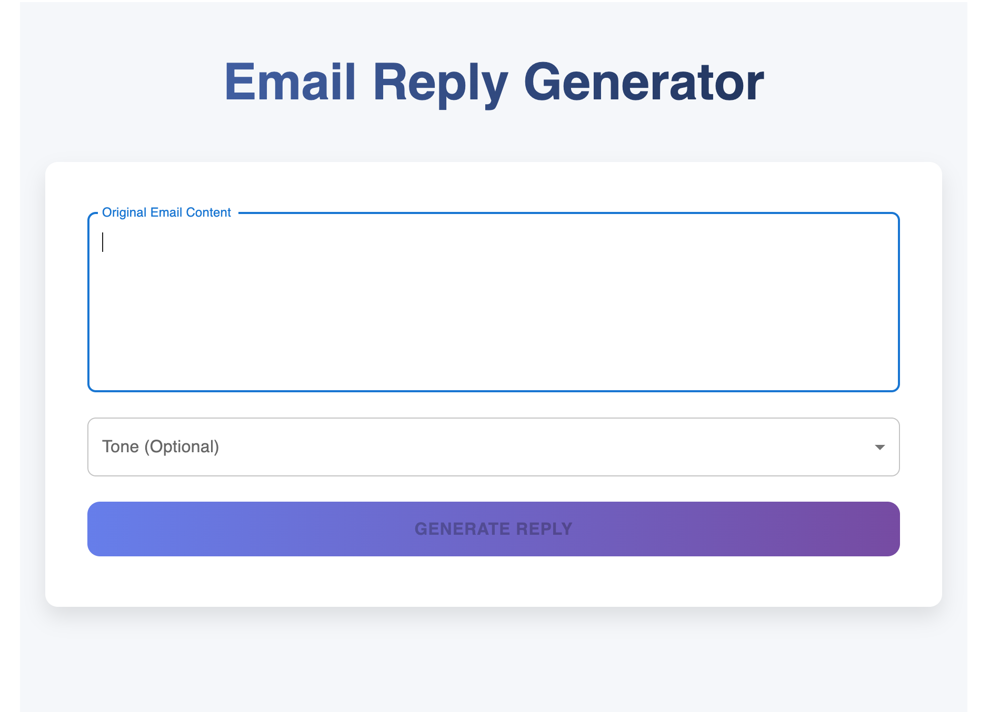
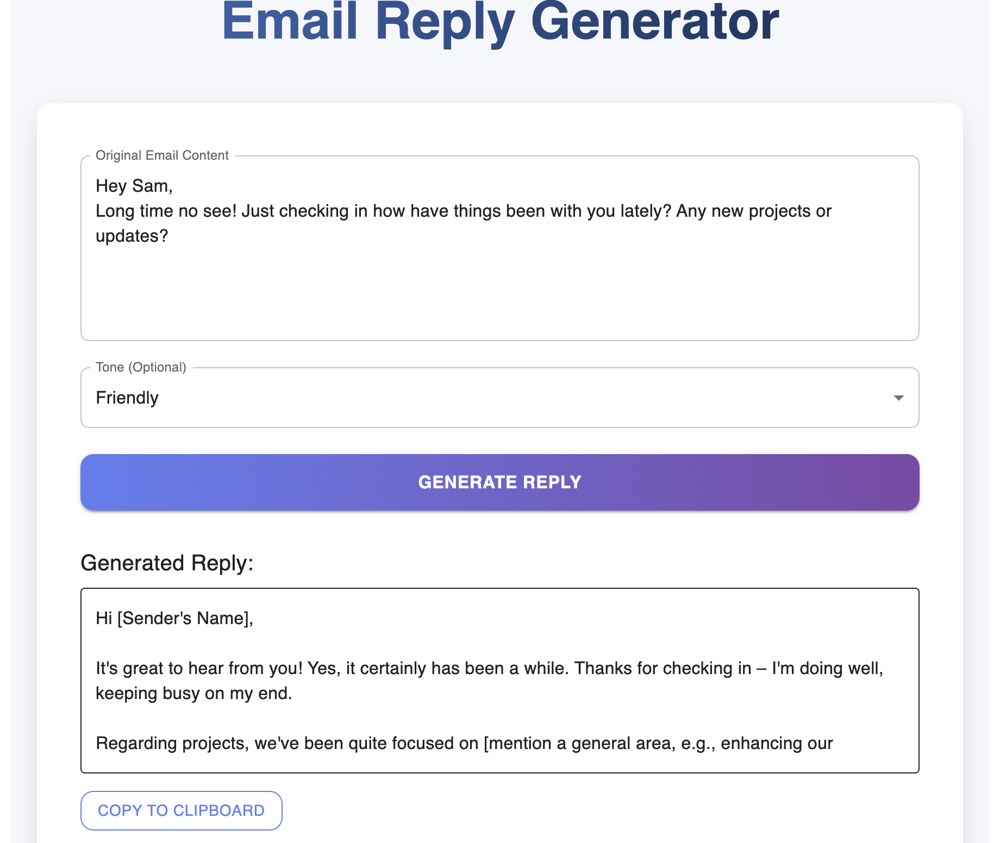

# AI Email Reply Generator
A full-stack application + Chrome extension that uses AI (Gemini API) to generate context-aware, tone-adjustable email replies.

---
## Things Learned:
- How to connect a React frontend with a Spring Boot backend, configure CORS and exchange data smoothly via REST. 
- Understanding request structures, authentication, prompt engineering and reading AI-generated responses. 
- Creating a manifest file, adding scripts, testing via Chrome’s dev tools and integrating extension UI with a backend service. 
- Using Material UI for layout and styles, building input forms, handling loading states and updating UI based on asynchronous API responses. 
- Building a service class (EmailGeneratorService) that communicates with an external AI API, handles errors and formats responses for the frontend.
---
## Backend Setup

```bash
cd backend
mvn clean install
mvn spring-boot:run

cd frontend
npm install
npm run dev

```

---
Chrome Extension Setup
1. Go to chrome://extensions
2. Enable Developer Mode
3. Select Load unpacked
4. Choose the /extension folder
---

---





